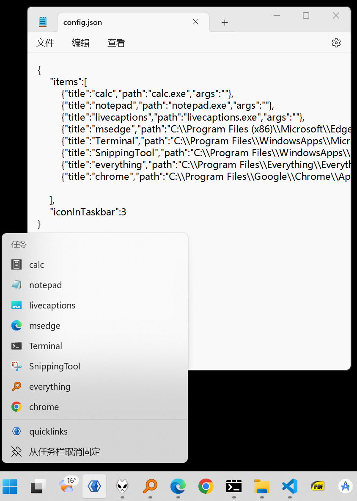

# quicklinks-taskbar-cpp
Create Quick Links/Shortcut in Taskbar for windows 11, you can define your links/shortcut in config.json, cpp coding with cppwinrt/wil/jumplist

## Compile 
open directory & cmake configure & cmake build, using vs code with cmake plugin and VS Build Tools 2022 installed.

## Usage

- Run Quicklinks.exe (with config.json in same directory)
- Pin Quicklinks.exe in frist/or other position of taskbar, and set as "action":"show" in config.json
- Right click the icon in taskbar, or WIN+1

## Screen 

## License

- GPLv3, Copyright by corbamico@163.com  
- library nlohmann/json, and library microsoft/wil under LICENSE.MIT
